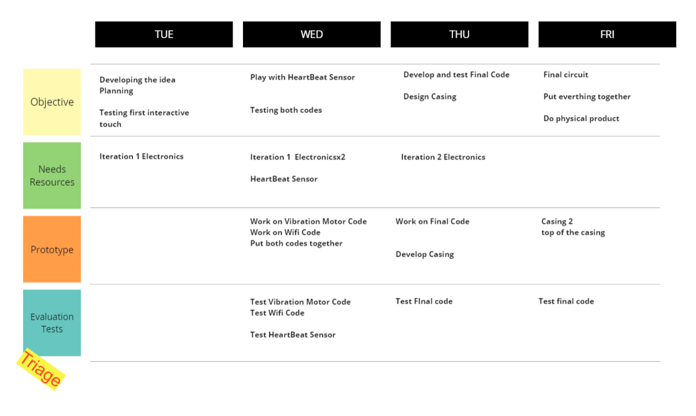
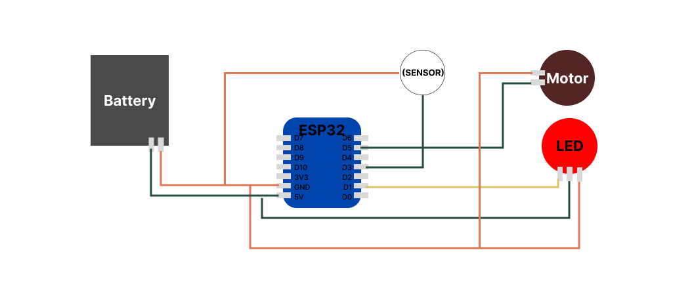
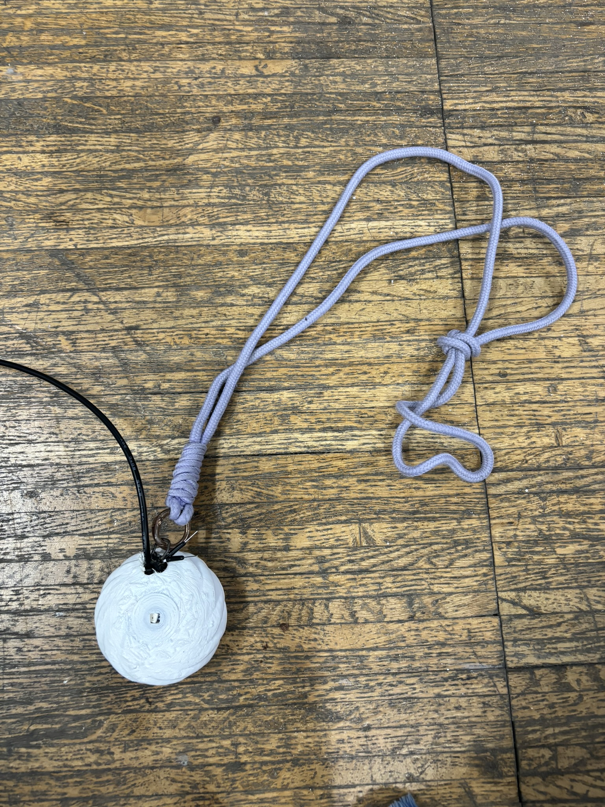

# microchallenge1
*Sophie Marandon - https://sophma.github.io/myMDEFportfolio/

Carmen Robres de Veciana - https://carmenrobres.github.io/portfolio/*

## Initial Idea
### Interests
We were both interested in the impact of technology on emotions and mental health as well as making imperceptible things perceptible, using technology to help us understand ourselves and others. In a world where anxiety and depression is on the rise, we therefore thought of ways to sense and visualise anxiety through technology to help us and others address this uncomfortable feeling.
### Concept
We decided to create a wearable device that would sense your anxiety and help you follow breathing exercises guided by vibrations to calm down. As anxiety is often an irrational feeling, it is hard to communicate to others. What is more, most people are not even consicous of the fact that they are anxious. This is why we decided to make this device collaborative: when it senses that you're anxious, the device sends a signal to a paired device (a partner, a friend etc.), which helps them understand how you're feeling and act accordingly, without needing any communication from your side.
### References
Products that are similar and already exist:

[BOND TOUCH Par de pulseras para parejas](https://www.amazon.com/-/es/BOND-TOUCH-pulseras-para-parejas/dp/B0C4BH8LKH/ref=sr_1_6?keywords=Long+Distance+Touch+Bracelets&qid=1707839897&sr=8-6)

[Totwoo Colección Candy](https://www.amazon.com/dp/B0CFY4G66S/ref=syn_sd_onsite_desktop_0?ie=UTF8&pd_rd_plhdr=t&aref=jWdT3daO2h&th=1) 

[MDEF project with soft electronics](https://www.youtube.com/watch?v=T2K_iBWEWjQ&t=46s)

### Planning

### Integrated Design 
Sensing anxiety with technology through anatomical parameters is challenging, as sensors, such as heartbeat sensors, are hard to calibrate. We therefore had to find a proxy indicator to sense anxiety. We decided to use fidgeting, as we often express anxiety through unconscious mimics. Fidgeting would be detected through a capacitive sensor which would detect when skin is touching the wearable. Having observed that we often play with our rings when we are anxious, our first idea was to create a ring, but we later realised that the electronics to operate the systems would take too much space to be integrated in a ring, so we decided to create a necklace instead.

The necklace consist of a pendant where all electronics would be integrated. To interact with the user, the pendant has a vibration motor on one side to guide the breathing exercise, a capacitive wire on the surface to detect touch when the user is fidgeting, and a LED light on the other side to signal when the user's partner is fidgeting. We first wanted to have the vibration in the neck, but opening the necklace to wear it would not have been possible with the soldered wires. We therefore decided to put the entire electronic mechanism in the pendant. 

## Process
### Electronics
The initial step in developing our product involved identifying all the necessary materials required to create the necklace. We opted for an ESP32 Xiao due to its compact size, Wi-Fi connectivity, and pin compatibility. Additionally, we selected a vibration motor for facilitating breathing exercises and a LED to indicate our partner's fidgeting. After finalizing our material choices, we conducted preliminary tests using the resources available in our class.

Instead of utilizing the ESP32 Xiao, we employed our Barduino, which already possessed Wi-Fi capabilities, a touch sensor, and an integrated LED. Our first test aimed to develop code replicating the breathing exercise on the Barduino. In this test, we utilized the LED to display the ascending and descending breathing patterns instead of a vibration motor.

#### Iteration 1: Barduino
After acquiring the vibration motor, our next step was to develop the code for the necklace using the Barduino along with the vibration motor. We chose this approach because it was the system we were most familiar with, and accessing all the components from a single board made development easier. This strategy allowed us to concentrate on code development, testing, and achieving functionality before refining the electronics to a smaller form factor.

Ultimately, the goal was for both the ESP32 Barduino and the ESP32 Xiao C3 to function in a similar manner. Therefore, the code developed in the initial iteration was intended to be compatible with the subsequent iteration.

Using the Barduino, we initially developed a code for the breathing exercise. Subsequently, we crafted a separate code enabling the connection of two devices via MQTT to illuminate each other's LEDs. Finally, we merged both codes into a unified solution. The coding process presented numerous challenges, detailed in the "code" section for further insight.

**Breathing Exercise**

**Wifi Connection**

These are the materials used on iteration 1: 

#### Playing with Heartbeat sensor
After effectively implementing the vibration breathing exercise, we contemplated when it should conclude and how to detect the easing of anxiety. Initially, we considered integrating a heartbeat sensor, aiming to conclude the breathing exercise upon detecting a specific reduction in the user's BPM. Throughout the afternoon, we delved into comprehending the sensor's functionality and attempted practical application. Despite some success, the sensor's inconsistency presented a significant challenge in accurately measuring data for calibration.

While we gained an understanding of its operation, we recognized that time constraints limited our ability to fine-tune its functionality for our project. Moreover, we acknowledged that anxiety might not always correspond to drastic BPM changes, making the sensor less suitable for our purposes. In the end, we decided that the relaxation exercise would conclude after completing five breathing repetitions instead of using a heartbeat sensor, equating to a minute of relaxed breathing.

#### Iteration 2: ESP32 XIAO C3
After finalizing the code, we proceeded to test it with our iteration 2 of electronics. We replaced the Barduino board with an ESP32 XIAO C3, along with the LED and motor components. Upon testing the code and connecting our two "raw necklaces", we encountered the need for modifications. Unfortunately, the ESP32 XIAO C3 lacked a touch sensor, necessitating adjustments to both our code and electronics.

To address this issue, we reconfigured the code to accommodate a touch button instead of a touchpad. Additionally, we had to modify the pin configurations to ensure compatibility with the new setup. Despite these challenges, we remained committed to ensuring the functionality of our project.

These were the circuit connections: The touch sensor was essentially two cables manually connected whenever we wanted to signal anxiety. Moving forward, we aim to refine this aspect to allow for more subtle activation, considering that anxious fidgeting often occurs unconsciously. Alternatively, we plan to explore using the ESP32 Xiao S3, which includes an available touch sensor, for enhanced functionality.

These are the materials used on iteration 2: 

### Code
**Code for the motor**
Creating the code for this necklace proved to be the most challenging aspect of the project. We had to simultaneously run two different functions and adapt to every iteration of electronics we employed.

The initial step involved coding for the vibration motor, which initially appeared straightforward. The vibration motor operated analogically, so our task was to control its intensity within the range of 0 to 255. To simulate ascending and descending vibrations, we programmed the motor to vibrate at specific intensities for 20 milliseconds using delays.

We enhanced the functionality by programming the motor to buzz twice when touched for the first time, indicating the imminent start of the breathing exercise. Additionally, we implemented a condition requiring the user to complete at least five breathing repetitions to stop the vibration motor. While the coding process was relatively simple, we encountered issues with the motor's functionality due to loose connections, as we hadn't soldered it directly to the Barduino. Although the initial code was functional, using delays to mark the breathing exercise posed challenges for subsequent iterations of the code setup.

**Code for Wifi**
The code utilized for the MQTT connection was adapted from our Barduino exercise conducted during class, accessible [here](https://fablabbcn-projects.gitlab.io/electronics/barduino-docs/mqtt/). We generated two separate codes: one for Sophie and another for Carmen. This enabled us to subscribe to each other's devices and exchange data seamlessly. 

**Final code**
The crucial moment arrived: we needed to consolidate all functionalities into one code that could simultaneously receive and send data while measuring the touch sensor and executing the vibration exercise. Initially, our implementation with delays in the vibration motor code caused issues where the necklace failed to maintain MQTT connectivity during breathing exercises.

To rectify this, we removed all delays and loops from the main loop to ensure continuous MQTT connection. However, this adjustment rendered the vibration motor incapable of executing the ascending and descending exercises without delays. Despite attempts to create custom delays using the millis function, we encountered challenges, leading us to temporarily set aside the ascending and descending actions and maintain a simple on/off functionality.

On another front, after successfully eliminating delays and ensuring proper connections, we tested the code on the ESP32 Xiao. This necessitated modifications to account for the device's reduced number of pins and the substitution of a button (digitalRead) for the touchpad (touchRead) since the ESP32 Xiao C3 lacked the latter function. This adaptation ensured compatibility with the new hardware setup.

### Fabrication process
For the pendant, we looked for a 3D model of a container that could be opened through a screwing mechanism to integrate the electronics seamlessly. We downloaded a model from Thingyverse and scaled it to a bigger size to be able to fit the electronics. We also added holes on both sides of the model to be able to plug in the LED light, the vibration motor, the chain and the future capacitive wires, as we plan to adapt the touch functionality in the future.

The 3D printing took several iterations, as the first models did not have enough adherence to the bed and failed. We therefore added a raft to the model for better adherence, and the ensuing prints were successful. We plan to reiterate a printing of the case upside down in the future as the the bottom of the case did not come out very clean.

### Build of Materials

Iteration 1: 2 Barduino, 2 BreadBoard, 2 Vibration motors.

Iteration 2: 2 Esp 32 Xiao C3, 2 Vibration motor, 2 Flora Neopixel, 2 Battery 3.3V, 2 3D printed Casing, 4 Cable sensor (fake button)

### Documents and files
In the repo you will find all the codes we generated with arduino. The final code is AnxietySensorWifi_SOPHIE_FINALXIAO.

The 3D fabricaton file: [necklace.pdf](https://github.com/carmenrobres/microchallenge1/files/14380475/necklace.pdf)

### References
[MDEF PROJECT](https://didac-torrent.github.io/mdef/pages/fabacademy/challenge_1.html)
[MQTT CODE](https://fablabbcn-projects.gitlab.io/electronics/barduino-docs/mqtt/)
[Info on the Motor](https://www.mouser.es/new/dfrobot/dfrobot-fit0774-mini-vibration-motor/?_gl=1*tfxj3x*_ga*ODIyMDc1NDU0LjE3MDc4NDY2OTI.*_ga_15W4STQT4T*MTcwNzg0NjY5MS4xLjAuMTcwNzg0NjY5Mi41OS4wLjA.*_ga_1KQLCYKRX3*MTcwNzg0NjY5MS4xLjAuMTcwNzg0NjY5Mi4wLjAuMA..)
[Pulse Sensor info](https://lastminuteengineers.com/pulse-sensor-arduino-tutorial/)
[Esp32 Xiao](https://www.tiendatec.es/maker-zone/microcontroladores/2139-seeed-xiao-esp32-s3-sense-camara-ov2640-wifi-bluetooth-8472496026451.html)

## Final Conclusions
We had big ambitions about this necklace during the ideation phase, but this was a humbling experience as we realised that developing what seem to be simple technology can be very cumbersome, especially in a short amount of time. We therefore scaled down on ambition. We however both learned a lot on the job,We would like to take our project further to better understand how it feels to live with such technology on a daily basis, as a 1st person perspective design intervention. This would get us closer to temporarily experiencing the life of a cyborg. We would also like to gather the data collected in a certain location to visualise anxiety at a given time and a given place, to see if visualising anxiety would change our relationship to it.

### Semi-Final Product

### Reflect about future development opportunity
- Instead of incorporating a fixed breathing exercise of 5 breaths, we could integrate a sensor capable of detecting when the user becomes more relaxed, thereby automatically halting the breathing exercise.

- Enhancing the casing to be smaller, more aesthetically pleasing, and easier to hang would be beneficial. Additionally, we could explore making the LED display more subtle, improving the structure for attaching the motor and exploring alternative touch sensor options, perhaps throughout the surface of the pendant, to enhance use experience.

- To address the challenge of demonstrating the ascending and descending vibration motor effects without delays, we need to explore alternative methods or technologies. This could involve experimenting with different coding techniques or possibly upgrading to a more advanced ESP32 Xiao model, such as the S3, which may offer additional capabilities, souch as an integrated touch sensor..

- Gather the data collected about anxiety to make a visual installation of the level of anxiety in a certain location, if several users are wearing the necklace.

- Incorporating an AI feature that sends notifications when the user is fidgeting, encouraging self-reflection on anxiety triggers through journaling, adds a valuable dimension to the necklace's functionality. This feature has the potential to foster mindfulness and self-awareness among users.

### Design boundaries and personal contributions
We both had a different set of design boundaries and orgnanised our contributions to the project accordingly as we had to split tasks to ensure that the microchallenge could be completed in the given timeframe. Carmen took care of the main coding elements as she had more experience with that than Sophie, while Sophie tested the heartbeat sensor with Arduino to figure out whether it was a viable option to integrate, as the heartbeat sensor was considered a "non-essential extra". Sophie also took care of the necklace design, modeling the design on Rhino and 3D printing it as she had experience manipulating Rhino and wanted to deepen her skills.

### Summary of the problems and how the team solved them

Coding & electronics:
- The code didn't let us connect to MQTT and do the breathing exercise at the same time - Reason: Delays! - WE HATE DELAYS WE NEED TO TAKE THEM OUT - Code without delays,  modified function to make the motor either on or off.
- Xiao didn't work with touch sensor - Change the code from touchRead to digitalRead, change the electronics so it works as a button instead of a touch sensor.
- Broke the battery :( - We needed to connect the necklace to a chargable battery

3D printing:
- As we realised later in the iterations that we needed an external touch button since our Xiao did not have one and an additional hole for the external battery, we adapted our design adding two holes to integrate the cables.
- The case did not print correctly at first so we added a raft for better adherence to the bed.

